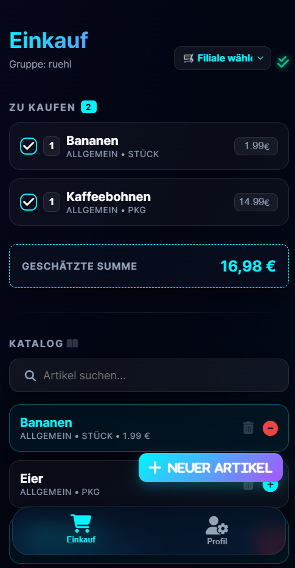

# 🛒 Gemeinsame Einkaufs-App (PWA)

Eine moderne, kollaborative Einkaufsliste, optimiert als Progressive Web App (PWA) für die mobile Nutzung. Teile deine Einkaufsliste mit der ganzen Familie in Echtzeit — DSGVO-konform, da alle Daten lokal in deiner eigenen MariaDB liegen.

<p align="center">
  
</p>

## ✨ Features
- 🏪 **Filial-bezogene Kataloge**: Jeder Artikel gehört zu genau einer Filiale (Aldi, Lidl, Apotheke …). Keine gruppenübergreifende Sichtbarkeit — DSGVO-Isolation pro (Gruppe, Filiale).
- 📱 **Mobile Optimized**: Premium-Design mit Glassmorphism-Effekten, optimiert für iPhone/Android (375px+).
- 🏷️ **Store Management**: Eigene Filialen pro Gruppe anlegen, löschen und wechseln.
- 🔐 **Group Access**: Sicherer Zugang über einen einfachen 6-stelligen Gruppen-PIN.
- 💰 **Budget Tracking**: Automatische Schätzung der Gesamtsumme basierend auf hinterlegten Preisen pro Filiale.
- 🔄 **Live Sync**: Polling-basierte Synchronisation alle 3 Sekunden — funktioniert zuverlässig in Shared-Hosting-Umgebungen.
- 📦 **PWA Ready**: Kann direkt auf dem Home-Bildschirm installiert werden und funktioniert offline.
- 🔒 **Defense in Depth**: Prepared Statements, FK-Validierung, Fehler-Codes (1062/1452), Längenlimits, HTML-Escaping.

## 🛠 Tech Stack
- **Frontend**: HTML5, Vanilla JavaScript (ES Module), CSS3 (Custom Properties).
- **Backend**: PHP 8+ mit PDO/MySQL.
- **Datenbank**: MariaDB / MySQL 8 (lokal oder Shared Hosting, z. B. XAMPP).
- **PWA**: Service Worker (`sw.js`) für Offline-Cache & Auto-Updates.
- **Icons**: FontAwesome 6.
- **Typo**: Outfit (Google Fonts).

## 🚀 Schnellstart
1.  **Repository klonen**:
    ```bash
    git clone https://github.com/glhsman/einkaufsliste.git
    cd einkaufsliste
    ```
2.  **Datenbank vorbereiten**:
    - MariaDB/MySQL-Server starten (z. B. XAMPP)
    - Datenbank `einkauf` anlegen
    - `database.sql` importieren (legt Tabellen für Gruppen, Filialen, Artikel, Einkaufsliste und Preishistorie an)
3.  **Konfiguration**:
    - `.env` im Hauptverzeichnis anlegen mit:
      ```
      DB_HOST=localhost
      DB_NAME=einkauf
      DB_USER=root
      DB_PASS=
      ```
4.  **Projekt starten**:
    - Apache + PHP aktivieren (XAMPP)
    - Browser: `http://localhost/einkauf/`
    - Neue Gruppe erstellen, PIN merken, loslegen.

## 📂 Struktur
- `index.php`: Hauptanwendung (Struktur, UI, PWA-Logik, Service Worker Registration).
- `api/index.php`: REST-Endpoint (Action-Dispatcher für `get_catalog`, `add_item`, `toggle_in_catalog`, `get_shopping_list`, `buy_item` …).
- `database.sql`: Komplettes Schema (Gruppen, Filialen, Artikel mit (Gruppe, Filiale)-Unique, Einkaufsliste, Preishistorie).
- `sw.js`: Service Worker für Offline-Funktionalität & Auto-Updates.
- `assets/css/style.css`: Modernes UI-Design System (Neon-Glassmorphism).
- `assets/js/app.js`: Frontend-Logik, API-Anbindung, Render-Funktionen.
- `migrations/`: Web-Tools für Schema-Updates (z. B. `v1.6.0_migrate.php`).
- `PROJEKT_STATUS.md`: Detaillierte Handover-Notizen (Architektur, offene Punkte).
- `security_datenschutz-check.md`: DSGVO-Checkliste.

## 🛡️ DSGVO / Datenschutz
- Alle Daten bleiben in deiner eigenen Datenbank (kein Cloud-Drittanbieter).
- Katalogartikel sind pro (Gruppe, Filiale) eindeutig (`UNIQUE (group_id, store_id, name)`) — keine globale Sichtbarkeit.
- Foreign-Key-Constraints mit `ON DELETE CASCADE` verhindern verwaiste Datensätze.
- Prepared Statements überall, keine String-Konkatenation in SQL-Queries.
- HTML-Escaping im Frontend gegen XSS.
- siehe `security_datenschutz-check.md`

## 📝 Letzte Änderungen

### v1.6.2
- 🐛 **Filialbezogene Einkaufsliste**: `get_shopping_list` liefert ohne aktive Filiale eine leere Liste (keine Legacy-Items mit `store_id IS NULL` mehr).
- 🐛 **`toggle_in_catalog` erzwingt Filiale**: Backend lehnt `store_id <= 0` ab; FK-Validierung „Store gehört zur Gruppe". DELETE nutzt jetzt `store_id` im WHERE.
- 🐛 **`renderCatalog` & `renderShoppingList`**: Drei kontextuelle Empty-States (kein Store / leere Filiale / alles auf Liste).
- 🛡️ **Frontend-Guards**: `toggleInCatalog`, `submitQuickAdd`, `openAddModal` blocken Aktionen ohne aktive Filiale mit klarem Toast.
- 🔄 **Stale-State-Cleanup**: `renderStoreSelector` verwirft verwaiste `activeStoreId` aus `localStorage` beim Gruppenwechsel.

### v1.6.1
- 🐛 **„Speicherfehler" aufgelöst**: Echte Fehlermeldungen statt generischem Toast (Backend liefert `data.error`, Frontend zeigt sie).
- 🛡️ **Store-Gate im Add-Modal**: Modal öffnet nicht ohne aktive Filiale, scrollt zu „Filialen verwalten".
- 🛡️ **Backend-Validierung**: `add_item` prüft, dass `store_id` zur `group_id` gehört; fängt FK-Verletzungen (1452) mit klarer Meldung.
- 🔄 **`loginAs`-Reset**: `activeStoreId` wird bei Gruppenwechsel geleert.

### v1.6.0 — Schema-Änderung: Items pro Filiale
- 🛡️ **DSGVO-Isolation**: `items` sind jetzt pro (Gruppe, Filiale) eindeutig (`UNIQUE (group_id, store_id, name)`, `NOT NULL`).
- 🛡️ **FK-Constraints**: `items.group_id` und `items.store_id` mit `ON DELETE CASCADE`.
- 🛡️ **Backend**: `get_catalog` filtert nach `group_id`+`store_id`; `add_item` schreibt `group_id`+`store_id`.
- 🔄 **Frontend**: `refreshData` und `submitQuickAdd` senden Filialen-Kontext.
- 📝 **Migration**: `migrations/v1.6.0_migrate.php` (Web-Form) + `v1.6.0_migrate.sql` (Referenz).
- ⚠️ **Breaking Change**: Bestehende DBs müssen migriert werden.

### v1.5.10
- 🎨 **Action-Button verkleinert**: Halbe Breite, rechts angedockt statt Vollbreite-zentriert.

### v1.5.9
- 📋 **Katalog blendet aktive Artikel aus**: Items, die bereits auf der Einkaufsliste stehen, werden im Katalog nicht mehr angezeigt.

### v1.5.8 — UI/UX Quick-Wins
- 🎨 **Kontrast**: `--text-muted` von `#94a3b8` auf `#cbd5e1` (bessere Lesbarkeit auf dunklem Hintergrund).
- 📱 **Touch-Targets**: Mindestgröße 36 px, primäre Buttons 44 px (Material-Design-Konformität).
- 📱 **iOS Safe-Area**: `env(safe-area-inset-*)` Padding für Home-Indicator und Notch.
- ♿ **A11y**: `:focus-visible` Outline für Tastatur-Navigation.
- ♿ **Reduced Motion**: `prefers-reduced-motion` deaktiviert Animationen.
- ✅ **Visuelles Feedback**: `line-through` für abgehakte Items.

### v1.4.x (historisch)
- Alphabetische Sortierung, BIGINT-Fix, Preiseingabe-Robustheit, PWA Auto-Update, sichtbare Versionsnummer.

## 📄 Lizenz
Dieses Projekt ist unter der MIT Lizenz lizenziert. Weitere Details findest du in der [LICENSE](LICENSE) Datei.
